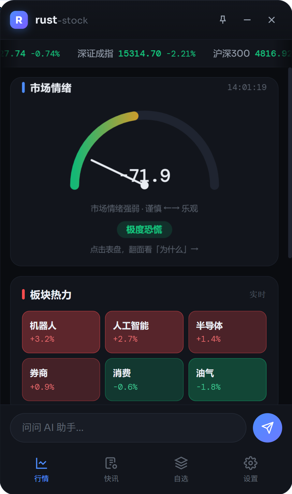
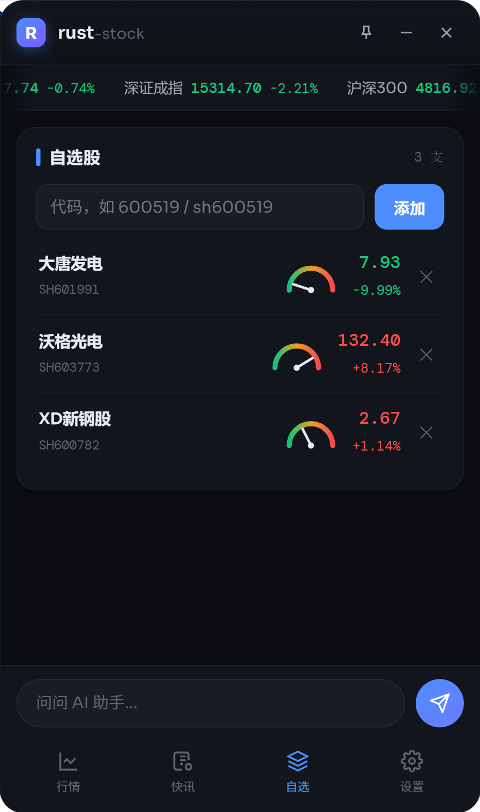
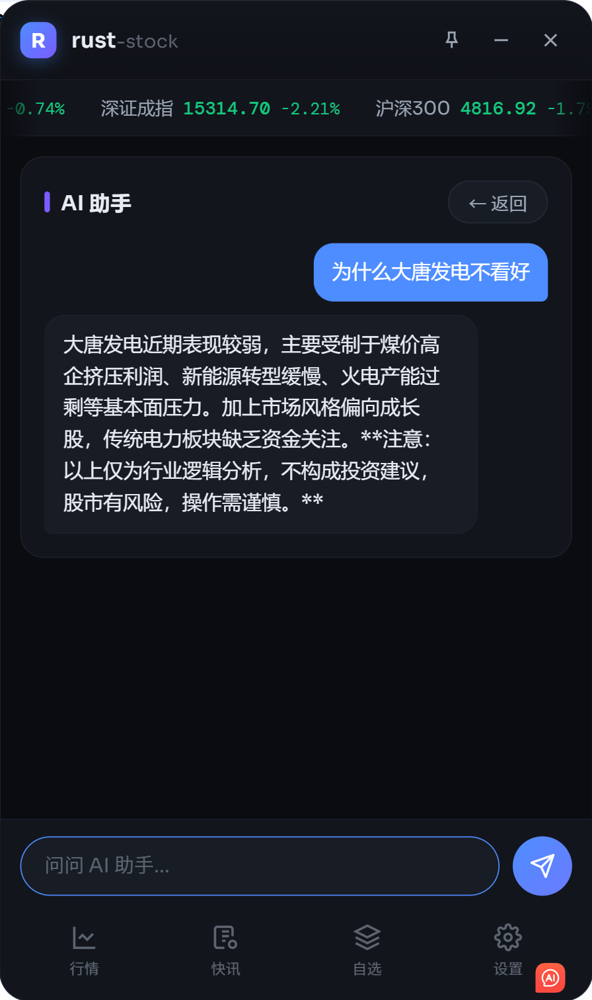
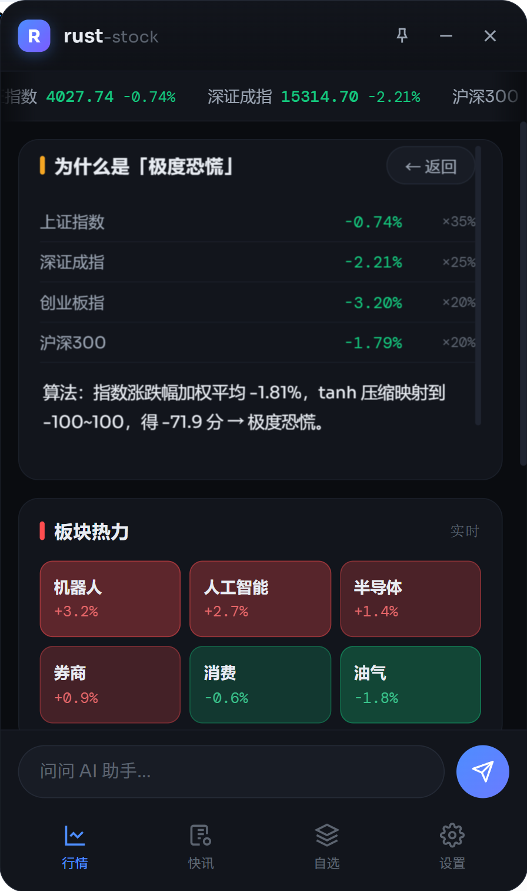
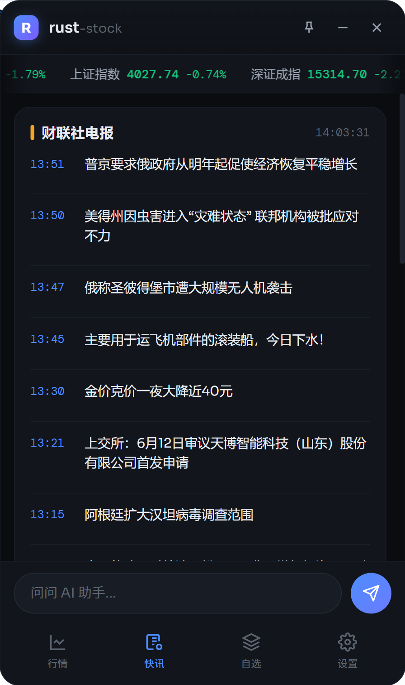
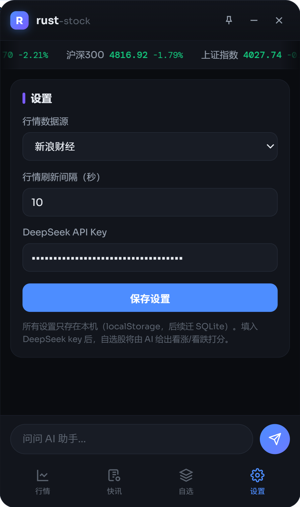

# rust-stock

<p align="center">
  
</p>

<p align="center">
  手机尺寸、可吸附屏幕边缘的悬浮股票行情助手<br/>
  Tauri 2 + Rust + 原生前端 · 纯本地运行 · 无服务器
</p>

<p align="center">
  <a href="LICENSE"></a>
  
  
  
</p>

---

## 它是什么

把臃肿的传统大窗口股票工具，改造成一个 **360×640 手机尺寸、置顶悬浮、拖到屏幕边缘自动吸附收起**的现代化小窗。深色纯净扁平风格，红涨绿跌（A 股习惯）。

参考 [ArvinLovegood/go-stock](https://github.com/ArvinLovegood/go-stock)（Wails + Go），本项目用 Tauri（Rust + 系统 WebView）重做：打包体积与内存占用远小于 Electron 系。

**核心原则：纯本地。** Rust 层只是本地逻辑（抓行情、调 AI、SQLite 读写），所有数据留在你电脑上，没有任何中转服务器。

## 界面预览

| 行情主页 | 自选股 + AI 打分 | AI 流式聊天 |
|:---:|:---:|:---:|
|  |  |  |

| 情绪翻面解读 | 7×24 快讯 | 设置 |
|:---:|:---:|:---:|
|  |  |  |

## 功能

- **悬浮窗体验**：无边框圆角置顶小窗，标题栏拖拽，拖到屏幕左右边缘自动吸附；点 ✕ 收起成 6px 小条，再点展开。窗口可自由缩放，UI 整体等比缩放
- **行情**：新浪财经 / 东方财富双数据源可切换，互为备份；指数无缝滚动条；自选股增删（支持 `600519` / `sh600519` 两种输入）
- **市场情绪表盘**：四大指数（上证/深成/创业板/沪深300）涨跌幅加权 + tanh 压缩，实时映射到 -100~100 指针；**点击表盘 3D 翻面**，背面是计算明细（每个指数的涨跌幅×权重）+ AI 结合盘面的解读
- **自选股 AI 打分**：每支自选股名称与价格之间有一个小仪表盘，DeepSeek 给出 -100（极度看跌）~ +100（极度看涨）综合打分，按天缓存；点击进入详情页看打分理由全文。未接入 AI 时指针停 0 并提示
- **AI 流式聊天**：底栏输入框直连 DeepSeek（SSE 流式，逐字出现），保留对话上下文
- **快讯**：东方财富 7×24 全球直播真实数据，60s 自动刷新，标红要闻带标签
- **本地持久化**：SQLite（rusqlite bundled），自选股/设置/AI 缓存全部落库，数据库单文件可拷走迁移
- **今日 AI 推荐**：每天 AI 结合当日情绪与指数详尽分析后推荐 3 支（基本面/技术面/消息面+风险提示）；同一支连续 ≥7 个推荐日出现会加 ★ 并注明天数；点击看分析全文
- **K线图**：自选股点名称进入，日/周/月K 蜡烛图（前复权）+ MA5/MA10 + 成交量，canvas 绘制零依赖
- **窗口记忆与自启**：记住上次窗口位置和大小；设置页一键开关开机自启动
- **右侧仪表盘挂件**：点最小化，主窗缩为屏幕右缘的竖排小挂件——每支自选股一个 AI 表盘 + 名称 + 涨跌幅；顶部把手可拖到任意位置，点击即还原主窗

## 快速上手

### 环境（一次性）

- [Rust 工具链](https://rustup.rs)（Windows 需 VS Build Tools 的"使用 C++ 的桌面开发"；macOS 需 Xcode CLT）
- Windows 10 可能需装 [WebView2 Runtime](https://developer.microsoft.com/microsoft-edge/webview2/)（Win11 自带）
- Tauri CLI：`cargo install tauri-cli --version "^2"`

### 运行

```bash
cd rust-stock
cargo tauri dev      # 开发调试（前端热重载）
cargo tauri build    # 打包安装包（Windows NSIS / macOS dmg）
```

### 纯前端预览（不装 Rust）

```bash
cd rust-stock/src && python3 -m http.server 8080
# 浏览器开 http://localhost:8080 ，数据走 mock
```

### 跑测试

```bash
cd rust-stock/src-tauri && cargo test
# 覆盖：行情解析（新浪/东财）、快讯解析、情绪算法、SQLite KV
```

## 配置 AI（可选）

设置页填入 API Key（默认 [DeepSeek](https://platform.deepseek.com)；Base URL / 模型可改成任意 OpenAI 兼容服务，如 Kimi、通义、本地 Ollama）。key 只存你本机 SQLite，本地直连。填入后自动启用：自选股 AI 打分、情绪 AI 解读、AI 聊天；不填则优雅降级并提示。

## 工程结构

```
rust-stock/
├── src/                       # 前端（原生 HTML/CSS/JS + ES modules，无框架无构建）
│   ├── index.html             # 全部 UI（样式内联）
│   ├── main.js                # 入口 bootstrap（接线/定时器）
│   └── js/
│       ├── bridge.js          # Tauri 桥接（浏览器预览降级）
│       ├── store.js           # 全局状态 + SQLite/localStorage 持久化
│       ├── api.js             # Tauri 命令封装
│       ├── ui.js / router.js  # 通用件 / 页面切换
│       └── pages/             # 行情 / 快讯 / 自选 / 聊天 / 设置
├── src-tauri/                 # Rust 本地逻辑层
│   ├── src/lib.rs             # Tauri 命令层（业务 prompt / 窗口控制）
│   ├── src/sources/           # 行情数据源抽象（QuoteSource trait + 注册表）★新增源在此加一行
│   ├── src/ai.rs              # AI Provider 抽象（OpenAI 兼容协议，base_url/model 可配）
│   ├── src/quote.rs           # 行情模型与解析器（含单测）
│   ├── src/feed.rs            # 快讯 + 情绪算法（含单测）
│   ├── src/storage.rs         # SQLite KV 持久化（含单测）
│   └── tauri.conf.json        # 窗口/打包配置
└── docs/                      # 开发文档 / 项目记忆 / 避坑记录
```

完整更新记录见本页底部 **[更新日志](#更新日志)**（倒序，最新在最上）。

更多细节：[开发文档](rust-stock/docs/DEVELOPMENT.md)

## Roadmap

- [ ] 板块热力接真实数据（当前为演示数据）
- [x] 数据源抽象为 trait，新增数据源即插即用（`sources/` 注册表）
- [x] 前端模块化拆分（原生 ES modules，无构建依赖）
- [x] GitHub Actions CI（cargo test + 前端语法检查）
- [x] 记住窗口位置和大小 / 开机自启动开关
- [ ] 系统托盘
- [x] K线图（日/周/月K + MA + 成交量）
- [ ] 个股详情页（盘口/资金流）

## 更新日志

> 倒序排列，最新更新在最上方。每次代码更新都会同步追加到这里。

## 2026-06-08（第十一批：自选股资讯利好/利空标注）

### 新增
- **自选股信息每条 AI 标注利好/利空**：标题前显示箭头——利好红「▲」、利空绿「▼」、中性灰「—」（A股红涨绿跌配色）。批量分类（一次请求判一批标题，省 token），结果按标题缓存到本地，不重复判断；未接 AI 时不显示箭头

## 2026-06-08（第十批：托盘 / 关闭确认 / 推荐报错修复）

### 新增
- **系统托盘**：常驻托盘图标，左键点图标还原主窗，右键菜单（显示主窗 / 退出）
- **关闭按钮二次确认**：点标题栏 ✕ 弹窗让用户选择「最小化到托盘」或「彻底退出」，可勾选记住选择；设置页可重置该记忆
- **深度调研改为按钮**：底部输入框左侧新增「研」切换按钮，点亮即进入深度调研模式再输入主题（不再需要手打"深度调研"前缀）

### 修复
- **AI 推荐「重新生成」报错**：详尽版长输出常被 max_tokens 截断导致 JSON 数组解析失败。修复：chat_once 加 180s 超时 + max_tokens 提到 8000；extract_json_array 增加截断容错（逐个抢救已完整的对象，含单测），只要有一支完整就不报错

## 2026-06-08（第九批：产业链研究法集成）

### 新增
- **AI 推荐/个股分析全面产业链化**（借鉴开源 Serenity 供应链瓶颈研究法）：推荐按"先排产业链层级→找稀缺层→再排公司"推理，每支理由 250~400 字，强制覆盖六小节——「产业链位置（上下游）/卡住的环节/排序原因（财务传导路径）/证据/主要风险/证伪条件」；个股分析 300~450 字，增加「误分类检验」与「未来1~4季度验证指标」
- **聊天「深度调研」模式**：输入「深度调研 + 主题」触发产业链八层拆解工作流（叙事→系统变化→层级排序→公司分类→优先研究清单→反共识方向→核实清单），结尾强制注明"未经实时新闻核验"
- **推荐战绩面板**：推荐卡片新增「📊 战绩」——用真实K线回算近 10 个推荐日每支的"推荐日收盘→最新收盘"收益，汇总胜率与平均收益，让 AI 推荐可被客观检验
- ai.chat_once 设置 max_tokens=7000，防详尽输出被截断

## 2026-06-08（第八批：打包修正）

### 修复
- bundle targets 移除 dmg（Mac 专用，混在 Windows 打包会报错）；Windows 默认出 NSIS 安装包，Mac 打包用 `cargo tauri build --bundles dmg`

## 2026-06-06（第七批：搜索添加自选）

### 新增
- 自选股支持**按公司名称 / 拼音首字母搜索添加**（东财 suggest 接口，输入"茅台"或"GZMT"即出下拉建议，点选或回车即加入；纯代码仍然直加），只收 A 股个股，港美股/基金/指数自动过滤

## 2026-06-06（第六批：仓库治理）

### 变更
- MEMORY.md / PITFALLS.md（项目记忆与避坑文档，含 docs/ 副本）从仓库移除并加入 .gitignore，此后仅作本地工作文档，不再同步 GitHub

## 2026-06-06（第五批：体验打磨）

### 新增
- **K线交互**：鼠标滚轮缩放（以光标为锚点，20~250 根）、按住拖动平移；250 根本地缓存，缩放平移零网络请求
- **自选股信息卡片**（行情页）：替换原 7×24 快讯，对每支自选并发抓取东财个股资讯（每支 6 条，合并去重取 20），任何股票都有内容；点击条目用系统浏览器打开原文；全量 7×24 保留在「快讯」tab
- **AI 推荐实时行情复核**：AI 提 6 候选 → 真实行情淘汰当日跌超 1.5% 与查无此码（幻觉代码）的标的 → 按分取前 3，行内展示真实"今日 ±x.xx%"
- **推荐一键加自选**：推荐行尾 ＋ 按钮，已在自选显示 ✓

### 修复
- 看跌股混进 AI 推荐（prompt 只许看涨标的 + Rust 侧 score≤0 过滤双保险；禁止 AI 编造当日涨跌幅）
- 「重新生成」无反馈似失灵（点击立即切"⏳ 生成中"占位、按钮禁用、重复点击弹提示、失败恢复旧结果）
- 自选页加载慢（缓存先行：进页秒开，行情后台刷新；缓存持久化 SQLite，重启首开也即时；行情按代码匹配防串行）
- 自选行仪表盘不对齐（价格列定宽 68px 右对齐）

## 2026-06-06（第四批：挂件与窗口）

### 新增
- **右侧仪表盘挂件**：最小化后主窗缩为 86px 竖排小窗——每支自选一个 AI 表盘+名称+涨跌幅，首次贴屏幕右缘，顶部把手可拖到任意位置，按数量自适应高度，点击还原主窗
- **记住窗口位置和大小**（SQLite 持久化，节流保存，启动恢复）
- **开机自启动开关**（设置页，tauri-plugin-autostart）
- **今日 AI 推荐**：每日 AI 详尽分析推荐 3 支（基本面/技术面/消息面+风险提示）；同一支连续 ≥7 个推荐日加 ★ 并注明天数；历史留 30 日
- **K线图页**：自选股点名称进入，日/周/月K 蜡烛图（前复权）+ MA5/MA10 + 成交量，canvas 零依赖

### 修复
- 主窗被恢复到屏幕外导致"启动不可见/点挂件没反应"（Windows 隐藏窗口 -32000 占位坐标入库；三层防御：不存隐藏坐标 + 恢复时夹回工作区 + 还原时强制拉回屏内）
- **仓库内 index.html 自首次提交即被同步问题截断**（缺 5 个页面和 script 标签，克隆构建 UI 整体瘫痪）：重建完整 729 行，CI 加 HTML 完整性守卫
- 挂件读不到自选（localStorage 老数据自动迁移回写 SQLite + 挂件读取双回退）

## 2026-06-06（第三批：可迭代架构 + CI）

### 重构
- **QuoteSource trait + 注册表**（`sources/`）：新增行情数据源只需实现 trait + 注册表加一行；统一代码格式，私有格式转换下沉到各源
- **AI Provider 抽象**（`ai.rs`）：OpenAI 兼容协议，Base URL/模型可配（默认 DeepSeek，可切 Kimi/通义/本地 Ollama）
- **前端 ES modules 化**：main.js 拆为 bootstrap + bridge/store/api/ui/router + 5 个页面模块，无构建依赖

### 新增
- GitHub Actions CI：cargo test + 前端全模块语法检查 + HTML 完整性守卫

## 2026-06-06（第二批：AI 深度集成）

### 新增
- 自选股行内 **AI 看涨/看跌小仪表盘**（-100~100，按日缓存），点击看分析全文；未接 AI 时指针停 0 并提示
- **市场情绪表盘点击 3D 翻面**：背面展示四大指数涨跌幅×权重明细 + 算法说明 + AI 解读
- **AI 流式聊天**（SSE 逐字输出，上下文保留 12 条）
- **SQLite 本地持久化**（rusqlite bundled，KV 存 JSON）
- **真实数据**：市场情绪=四大指数加权 + tanh 压缩；快讯=东财 7×24（实测修通 sortEnd/req_trace 必填参数）

### 修复
- 快讯一直显示 mock（接口必填参数缺失被静默拒绝）
- 情绪分数负号被指针线遮挡

## 2026-06-05（首版）

- Tauri 2 + Rust + 原生前端的手机尺寸悬浮行情助手（360×640，无边框置顶圆角）
- 拖到屏幕边缘自动吸附；✕ 收起成 6px 小条；窗口自由缩放（UI 等比）
- 新浪/东方财富双数据源行情、指数滚动条、自选股增删
- 四页框架：行情 / 快讯 / 自选 / 设置
- 修复：透明窗口圆角外伪影、withGlobalTauri 缺失、Tauri 2 capabilities 缺失
- 开源：Apache-2.0，发布至 GitHub（Im-Midi/rust-stock）

---

## 声明

行情与快讯数据来自第三方公开接口（新浪财经、东方财富），仅供学习研究，商用前请自行确认数据源授权。AI 分析内容由大模型生成，仅供参考，不构成投资建议。投资有风险，入市需谨慎。

## 致谢

- [ArvinLovegood/go-stock](https://github.com/ArvinLovegood/go-stock) — 本项目的灵感来源
- [Tauri](https://tauri.app) · [DeepSeek](https://deepseek.com)

## License

[Apache License 2.0](LICENSE)
